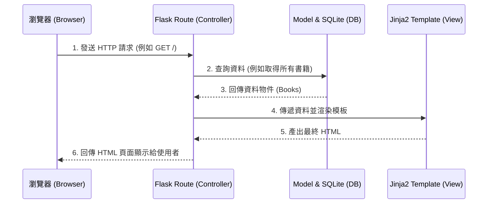

# 系統架構設計文件 (ARCHITECTURE)：讀書筆記本系統

## 1. 技術架構說明
本系統採用傳統的伺服器端渲染 (Server-Side Rendering) 架構，不區分前後端分離。透過 Python 的輕量級 Web 框架 Flask 作為核心，結合 Jinja2 模板引擎與 SQLite 資料庫來打造輕便、易於維護的應用程式。

### 選用技術與原因
- **後端框架：Flask**
  - **原因**：輕量且極具彈性，非常適合用來快速打造 MVP 與中小型應用。對初學者友善，進入門檻低。
- **模板引擎：Jinja2**
  - **原因**：與 Flask 完美整合，能夠直接在 HTML 檔案中使用 Python 變數與邏輯（如迴圈、條件判斷），實作動態頁面渲染。
- **資料庫：SQLite**
  - **原因**：不需要額外安裝與設定獨立的資料庫伺服器，資料儲存在單一檔案中，非常適合輕量級的專案與本地端開發。

### MVC 模式說明
雖然 Flask 本身是微框架，但我們將依循類似 MVC（Model-View-Controller）模式的概念來組織程式碼：
- **Model (資料模型)**：負責定義資料庫的表格結構與資料操作邏輯（建立、讀取、更新、刪除）。
- **View (視圖)**：由 Jinja2 模板與 CSS 負責，呈現使用者看到的網頁介面。
- **Controller (控制器)**：在 Flask 中由 `Routes` 擔任，負責接收使用者的請求 (Request)、操作 Model 處理資料，最後將資料傳遞給 View 進行渲染。

## 2. 專案資料夾結構

```text
web_app_development/
├── app/
│   ├── __init__.py      ← 初始化 Flask 應用程式的工廠函式
│   ├── models/          ← 資料庫模型 (Model)
│   │   └── models.py    ← 定義 Book 等資料表結構
│   ├── routes/          ← Flask 路由與邏輯處理 (Controller)
│   │   └── main.py      ← 處理首頁、新增書籍、撰寫心得等主要路由
│   ├── templates/       ← Jinja2 HTML 模板 (View)
│   │   ├── base.html    ← 共用的版型 (如導覽列、頁尾)
│   │   ├── index.html   ← 首頁 (書單列表)
│   │   └── detail.html  ← 書籍詳情與心得頁面
│   └── static/          ← CSS / JS 靜態資源
│       ├── css/
│       │   └── style.css ← 系統樣式
│       └── js/
│           └── main.js   ← 前端互動邏輯 (選用)
├── instance/
│   └── database.db      ← SQLite 資料庫檔案
├── docs/
│   ├── PRD.md           ← 產品需求文件
│   └── ARCHITECTURE.md  ← 系統架構設計文件 (本文件)
├── app.py               ← 應用程式的入口，負責啟動伺服器
├── requirements.txt     ← Python 依賴套件清單
└── README.md            ← 專案說明與啟動步驟
```

## 3. 元件關係圖

以下展示使用者從瀏覽器發出請求到伺服器回傳網頁的整體流程：



## 4. 關鍵設計決策

1. **採用藍圖 (Blueprints) 管理路由**
   - **原因**：雖然專案初期不大，但為避免所有路由都塞在同一個檔案中，我們將使用 Flask 的 Blueprint 功能，把相關的路由拆分到 `routes/` 目錄下，這能提升程式碼的結構與未來擴充性。
2. **採用伺服器端渲染 (SSR)**
   - **原因**：相較於使用 React/Vue 等前端框架搭配 REST API 的做法，直接使用 Jinja2 渲染 HTML 可以大幅減少開發的複雜度，使我們能專注於核心功能的實作，快速驗證產品想法。
3. **使用 SQLAlchemy 作為 ORM (Object Relational Mapping)**
   - **原因**：為簡化資料庫操作並防止 SQL Injection，決定使用 Flask-SQLAlchemy。它允許我們使用 Python 物件來操作資料庫，而不必撰寫繁雜且容易出錯的原生 SQL 語法，後續維護也會更加容易。
