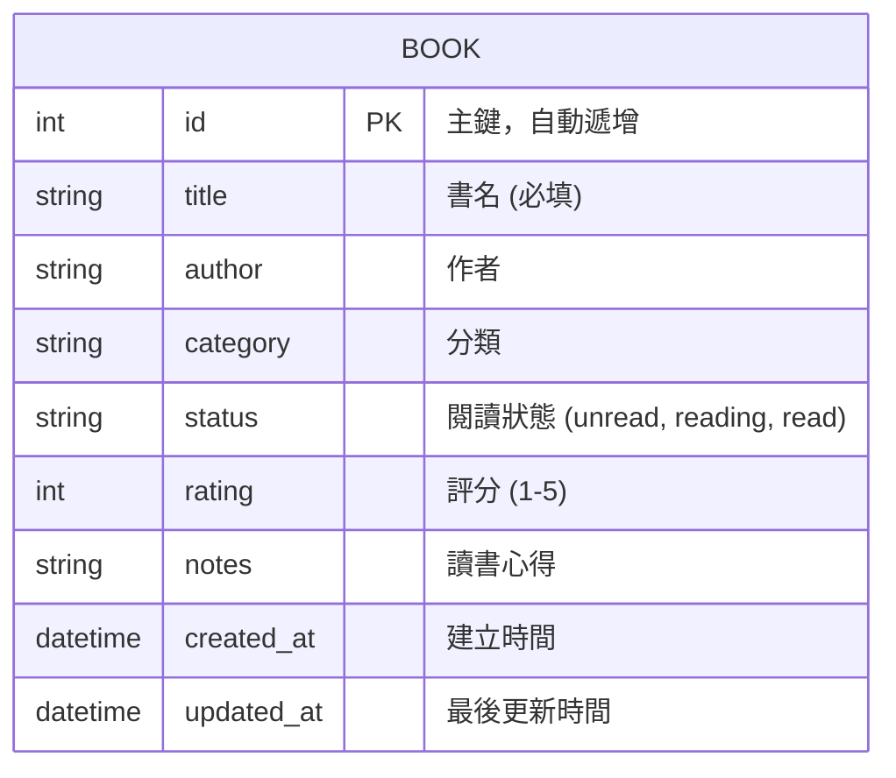

# 資料庫設計文件 (DB DESIGN)：讀書筆記本系統

本文件基於產品需求 (PRD) 與系統架構 (ARCHITECTURE) 進行資料庫 Schema 設計，使用 SQLite 資料庫與 SQLAlchemy ORM。

## 1. ER 圖（實體關係圖）

系統目前以輕量化為主，核心資料皆圍繞在「書籍」上，因此主要設計一個 `BOOK` 資料表。

## 2. 資料表詳細說明

### `books` 資料表

負責儲存使用者新增的書籍資訊、閱讀狀態與心得筆記。

| 欄位名稱 | 型別 | 必填 | 說明 |
| --- | --- | --- | --- |
| `id` | INTEGER | 是 | Primary Key，自動遞增 |
| `title` | VARCHAR(255) | 是 | 書籍名稱 |
| `author` | VARCHAR(255) | 否 | 書籍作者 |
| `category` | VARCHAR(100) | 否 | 書籍分類或標籤 |
| `status` | VARCHAR(50) | 是 | 閱讀狀態，預設為 `unread` (未讀)。其他包含 `reading` (閱讀中)、`read` (已完讀) |
| `rating` | INTEGER | 否 | 書籍評分，範圍為 1 到 5 |
| `notes` | TEXT | 否 | 讀書心得與筆記 |
| `created_at` | DATETIME | 是 | 記錄建立時間，預設為當下時間 |
| `updated_at` | DATETIME | 是 | 記錄最後修改時間，更新時自動修改 |

## 3. SQL 建表語法

請參考 `database/schema.sql` 檔案。我們同時提供了原生的 SQL 建立語法供參考。

## 4. Python Model 程式碼

根據架構文件，我們採用 Flask-SQLAlchemy。相關 Model 程式碼與 CRUD 操作方法實作於 `app/models/models.py` 檔案中。
