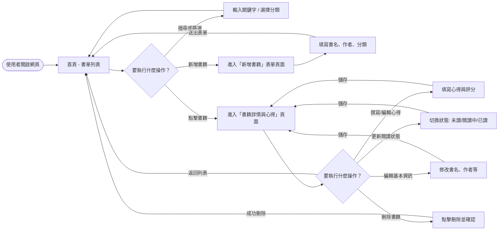
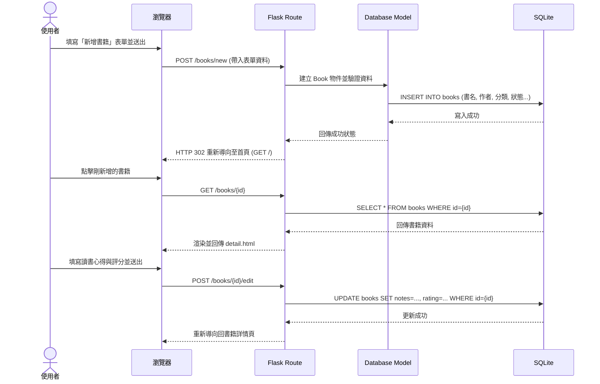

# 流程圖設計文件 (FLOWCHART)：讀書筆記本系統

本文件根據產品需求 (PRD) 與系統架構 (ARCHITECTURE) 進行視覺化設計，說明使用者在網站中的操作路徑與系統內部的資料流動。

## 1. 使用者流程圖 (User Flow)

此流程圖展示使用者進入讀書筆記本系統後，能夠執行的所有主要操作，包含查看書單、新增書籍、以及針對特定書籍的編輯與心得撰寫等。

## 2. 系統序列圖 (Sequence Diagram)

此圖描述使用者「新增一本書籍並撰寫心得」的完整後端資料流與互動過程。

## 3. 功能清單對照表

以下為系統核心功能對應的 URL 路徑與 HTTP 方法初步規劃：

| 功能名稱 | URL 路徑 | HTTP 方法 | 說明 |
| --- | --- | --- | --- |
| 首頁 / 書單列表 | `/` | GET | 顯示所有書籍列表，可包含搜尋與篩選參數 |
| 顯示新增表單 | `/books/new` | GET | 呈現新增書籍的 HTML 表單頁面 |
| 處理新增書籍 | `/books/new` | POST | 接收表單資料，寫入資料庫後導向首頁 |
| 書籍詳情與心得 | `/books/<id>` | GET | 顯示特定書籍的詳細資料、閱讀狀態與心得 |
| 更新書籍資訊/心得 | `/books/<id>/edit` | POST | 接收更新的書籍資料、狀態、心得或評分 |
| 刪除書籍 | `/books/<id>/delete` | POST | 從資料庫刪除該書籍並導向首頁 |

> 註：為符合傳統 HTML 表單只支援 GET 與 POST 的限制，編輯與刪除操作將透過 POST 方法實作（或可於表單中使用隱藏欄位控制實際行為）。
